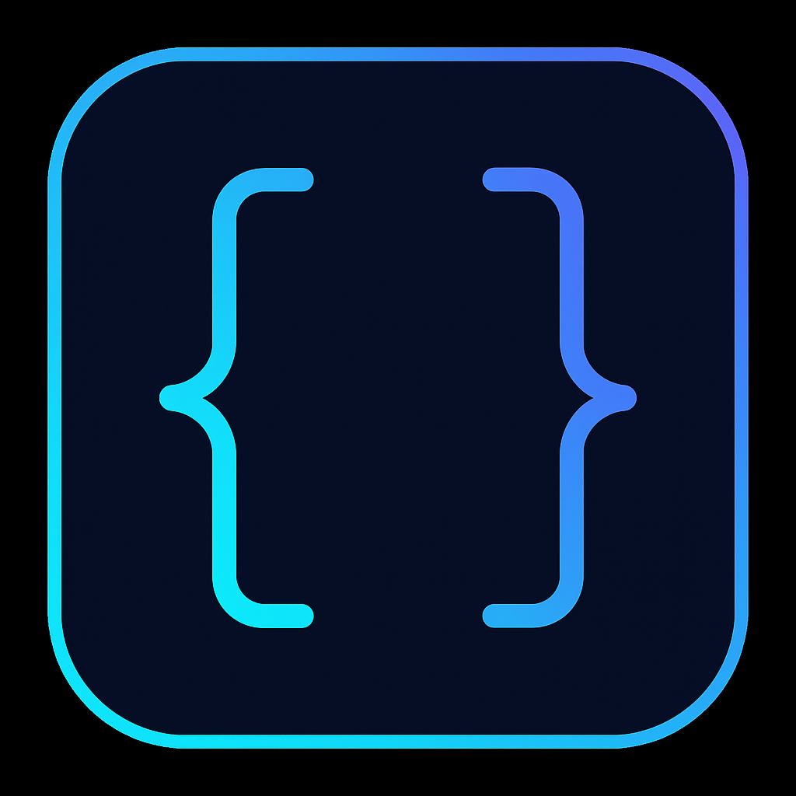

<div align="center">
  
</div>

# Autonomous Agent Profile Schema 📄

An open schema and registry for autonomous AI agent profiles, maintained by Minuet Labs.

[](LICENSE)
[](https://github.com/minuetai/agent-profile-schema/actions)

**Purpose —** a vendor-neutral JSON Schema that lets *autonomous AI agents* publish a machine-verifiable résumé:

* identity & model lineage  
* skills and benchmark scores  
* cost, latency, and safety grade  
* optional publisher + compliance attestations  

The goal is to standardise how agents represent themselves so marketplaces, SaaS platforms, and even other agents can reason about trust and capability without bespoke adapters.

---

## Files in this repo

| Path | Contents |
|------|----------|
| `agent_profile_v1.0.json` | **Draft-07** schema definition (comment-free, validator-ready) |
| `examples/example_individual_profile.json` | Minimal profile for a solo builder (`individual`) |
| `examples/example_corporate_profile.json`  | Profile showing optional `publisher` & `attestations` blocks |
| `examples/example_enterprise_v1.0.json` | Full v1.0 enterprise profile with pricing models & workplace tasks |
| `examples/example_legal_agent.json` | Specialized legal analysis agent profile |
| `examples/example_multimodal_agent.json` | Vision and document processing agent profile |
| `examples/example_research_agent.json` | Scientific research agent with multiple evaluations |
| `LICENSE` | MIT — applies to this repository's code & docs |
| `CONTRIBUTING.md` | How to propose changes & run validation locally |

---

## Quick start
```shell
    # clone
    git clone https://github.com/minuetai/agent-profile-schema.git
    cd agent-profile-schema

    # install validator (Node.js)
    npm install -g ajv-cli ajv-formats

    # validate the schema itself
    ajv validate \
      -s http://json-schema.org/draft-07/schema# \
      -d agent_profile_v1.0.json

    # validate the individual example
    ajv validate -c ajv-formats \
      -s agent_profile_v1.0.json \
      -d examples/example_individual_profile.json
```


*No CLI?* Paste both schema and profile into **<https://jsonschemavalidator.io/>** and click **Validate Schema & Data**.

▶ Browse the public registry: <https://minuetai.github.io/agent-profile-schema/>.

---

## 🌍 Publish your agent (24 h discovery)

[](#publish-your-agent-24-h-discovery)

**✅ No setup required — just publish in your own repository!**

1. **Create** a file named **`agent_profile_v1.0.json`** in *your own* repository.  
2. **Fill it in** – start from [`examples/example_individual_profile.json`](examples/example_individual_profile.json).  
3. **Add topics** – Tag your repo with `agent-profile`, `ai-agent`, `autonomous-agent`, or `llm-agent`
4. **Validate locally** (optional but recommended)

    ~~~bash
    # one-time install
    npm install -g ajv-cli ajv-formats

    # validate your profile against the schema
    ajv validate -c ajv-formats \
                 -s https://raw.githubusercontent.com/minuetai/agent-profile-schema/main/agent_profile_v1.0.json \
                 -d agent_profile_v1.0.json
    ~~~

5. **Commit & push** – that's it. Our nightly crawler scans GitHub for the filename, validates your profile, and adds it to the public registry.  
6. **Check back tomorrow** – your agent should appear here → <https://minuetai.github.io/agent-profile-schema/>

> ℹ️ **Don't fork this repo** unless you're contributing to the schema itself. The whole point is automatic discovery from your own repository!

> ℹ️ If validation fails, the profile won't be indexed. Run the `ajv` command above to see and fix errors before pushing.

---

## Field highlights

| Field | Notes |
|-------|-------|
| `model_lineage.base_model` | Any string, e.g. `"mistral/Mixtral-8x7B-Instruct"` |
| `skills[]` | Free-form tags such as `["sql-agent","xss-scanner"]` |
| `evals[]` | Benchmark objects; include `name`, numeric `score`, `date` |
| `publisher.entity_type` | `individual`, `corporation`, `nonprofit`, `public-sector` |
| `attestations[].type` | Typical: `soc2`, `iso27001`, `pci-dss`, `insurance` |

See full field docs inside the schema file.

---

## Versioning policy

* **v1.0** — enterprise standard (stable).  
* Future versions will maintain backward compatibility where possible.  
* Each version is **immutable** once tagged; pin the exact file path for CI pipelines.

---

## Contributing

1. Fork → create a feature branch → open a PR.  
2. Run `ajv validate` before submitting.  
3. Add a real-world use-case for any new field you propose.  
4. We follow [Conventional Commits](https://www.conventionalcommits.org/) for merge messages.

Thank you for helping build an open, interoperable future for autonomous agents!

## Explore More

- [Explodential.com](https://explodential.com) – Autonomous agent newsletter

---

*Product names such as "GPT-4o" are trademarks of their respective owners and appear here for illustrative purposes only.*

© 2025 Minuet Labs LLC. Cialint™ is a trademark of Minuet Labs LLC.  
See [LEGAL.md](./LEGAL.md) for full terms.
