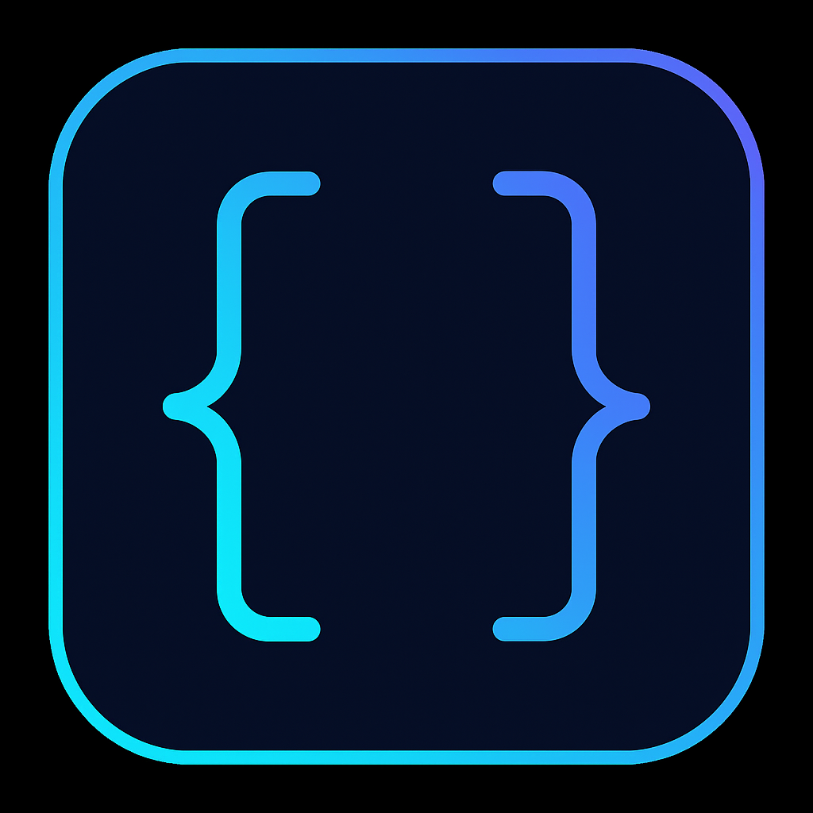

<div align="center">
  
</div>

# Agent Schema

**Agent Schema** — A vendor-neutral standard for describing AI agents and enabling cross-ecosystem interoperability.

[](./schema.json)
[](./docs/Field-Mapping-Overview-v1.0.md)
[](https://github.com/minuetai/agents/actions)
[](./LICENSE)
[](./docs/mappings/CONTRIBUTING.md)

---

## Overview

The canonical schema for AI agent discovery and interoperability. Enables autonomous agents to publish machine-verifiable definitions with:

* identity & model lineage
* skills and benchmark scores
* cost, latency, and safety grade
* publisher verification & compliance attestations

Standardizes agent representation across marketplaces, platforms, and ecosystems — eliminating bespoke adapters and enabling seamless interoperability.

---

## Schema Quick Reference

The schema is located at `schema.json` (JSON Schema Draft-07, validator-ready). See `examples/` for reference implementations. Each example demonstrates a valid schema instance:

| Example | Use Case |
|---------|----------|
| `example_individual_agent.json` | Solo builder / minimal profile |
| `example_corporate_agent.json` | Corporate agent with publisher & attestations |
| `example_enterprise_v1.0.json` | Full enterprise agent (pricing, workplace tasks) |
| `example_legal_agent.json` | Specialized legal analysis agent |
| `example_multimodal_agent.json` | Vision and document processing |
| `example_research_agent.json` | Scientific research agent with evals |

Browse all examples → [`/examples/`](./examples/)

---

## Validation & Integration

**Quick validation (local):**
```bash
# Install validator (Node.js)
npm install -g ajv-cli ajv-formats

# Validate your agent against schema
ajv validate -c ajv-formats \
  -s https://minuetai.github.io/agents/schema.json \
  -d your-agent.json
```

**No CLI?** Paste schema and agent JSON into **<https://jsonschemavalidator.io/>** and click **Validate Schema & Data**.

**Schema URLs:**
- **Latest** (recommended): `https://minuetai.github.io/agents/schema.json`
- **Pinned v1.0.0** (production): `https://raw.githubusercontent.com/minuetai/agents/v1.0.0/schema.json`

See [CONTRIBUTING.md](./CONTRIBUTING.md) for local validation setup.

---

## Documentation & Mappings

Comprehensive field documentation and ecosystem mappings are available in `/docs/`:

- **[Field Mapping Overview](./docs/Field-Mapping-Overview-v1.0.md)** — How Agent Schema fields map to LangChain, AWS Bedrock, OpenRouter, and other frameworks
- **[Mappings Directory](./docs/mappings/)** — Detailed framework-specific mappings
- **[CI/CD Validation](./docs/mappings/CONTRIBUTING.md)** — Governance for maintaining mappings

---

## 🚀 Publish your agent (24 h discovery)

**No setup required — just publish in your own repository!**

1. Create a file named **`agent.json`** in your own repository
2. Fill it in using [`examples/example_individual_agent.json`](examples/example_individual_agent.json) as a template
3. Add topics: `agent-profile`, `ai-agent`, `autonomous-agent`, or `llm-agent`
4. Validate locally (optional but recommended) — see [Validation & Integration](#validation--integration) for setup
5. Commit & push — our nightly crawler scans GitHub, validates your agent, and adds it to the public registry
6. Check the registry → <https://minuetai.github.io/agents/>

> ℹ️ Don't fork this repo unless contributing to the schema itself. Automatic discovery works best with agent definitions in *your* repositories.

---

## Field Highlights

| Field | Notes |
|-------|-------|
| `model_lineage.base_model` | Base model identifier, e.g., `"mistral/Mixtral-8x7B-Instruct"` |
| `skills[]` | Free-form capability tags, e.g., `["sql-agent", "xss-scanner"]` |
| `evals[]` | Benchmark results with `name`, numeric `score`, and `date` |
| `publisher.entity_type` | `individual`, `corporation`, `nonprofit`, or `public-sector` |
| `attestations[].type` | Compliance indicators: `soc2`, `iso27001`, `pci-dss`, `insurance` |

Full field documentation is in `schema.json`.

---

## Registry Infrastructure

The **Agent Registry** at [minuetai.github.io/agents/](https://minuetai.github.io/agents/) automatically discovers and indexes agents published on GitHub.

**How it works:**
- A nightly crawler searches GitHub for repositories tagged with `agent-profile`, `ai-agent`, `autonomous-agent`, or `llm-agent`
- It looks for an `agent.json` file at the repository root
- If validation passes, the agent is added to the public registry
- If validation fails, the agent is skipped (check your `agent.json` against the schema)

---

## Versioning Policy

- **v1.0** — Enterprise standard (stable)
- Future versions will maintain backward compatibility where possible
- Each version is immutable once tagged; pin exact file paths for production CI/CD pipelines
- Follows Semantic Versioning: Major.Minor.Patch (1.0.0, 1.1.0, 2.0.0)

---

## Governance & Contribution

This is an open standard project. Contributions are welcome!

**Contributing:**
1. Fork → create a feature branch → open a PR
2. Run `ajv validate` to check your changes
3. For new schema fields, include a real-world use case
4. Follow [Conventional Commits](https://www.conventionalcommits.org/) for messages

**Governance:**
- See [CONTRIBUTING.md](./CONTRIBUTING.md) for contribution guidelines
- See [GOVERNANCE.md](./GOVERNANCE.md) for decision-making framework
- See [LEGAL.md](./LEGAL.md) for terms and attribution

Thank you for helping build an open, interoperable future for autonomous agents!

---

## Learn More

- **[Explodential.com](https://explodential.com)** — Autonomous agent newsletter & research
- **[Validator](https://jsonschemavalidator.io/)** — Online schema validator

---

<sub>Product names such as "GPT-4o" are trademarks of their respective owners and appear here for illustrative purposes only.</sub>

<sub>© 2025 Minuet Labs LLC. Cialint™ is a trademark of Minuet Labs LLC. See [LEGAL.md](./LEGAL.md) for full terms.</sub>
